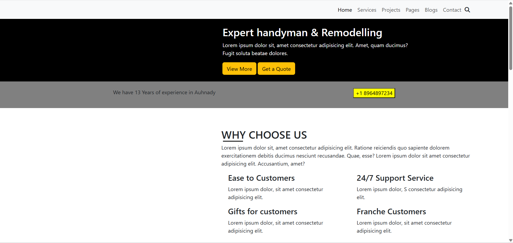
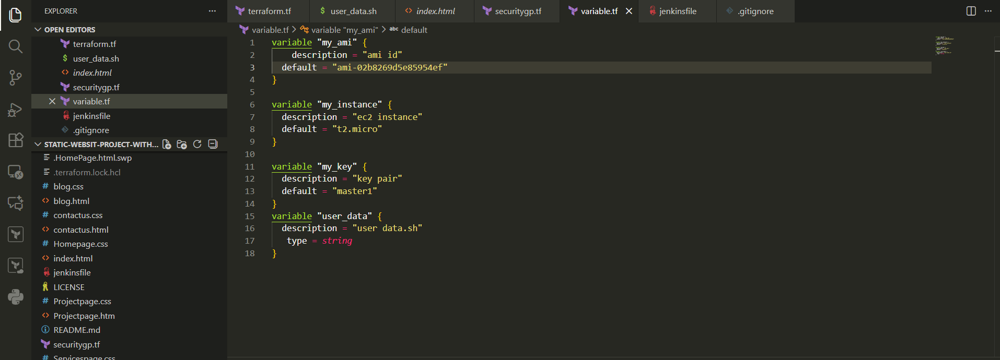
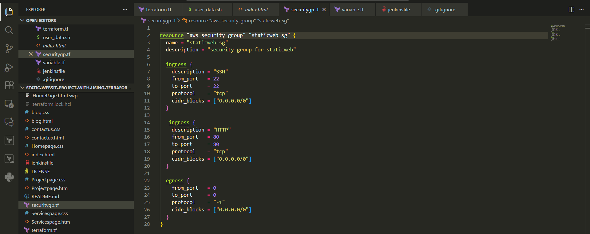
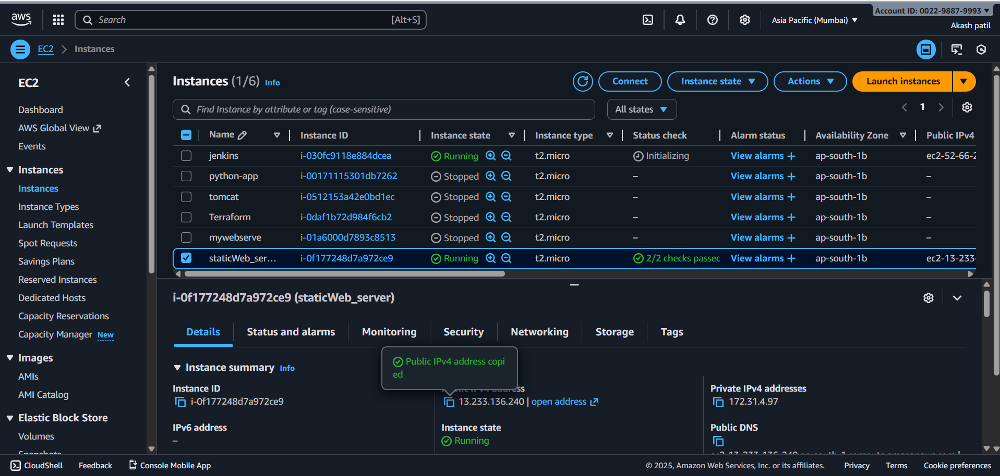
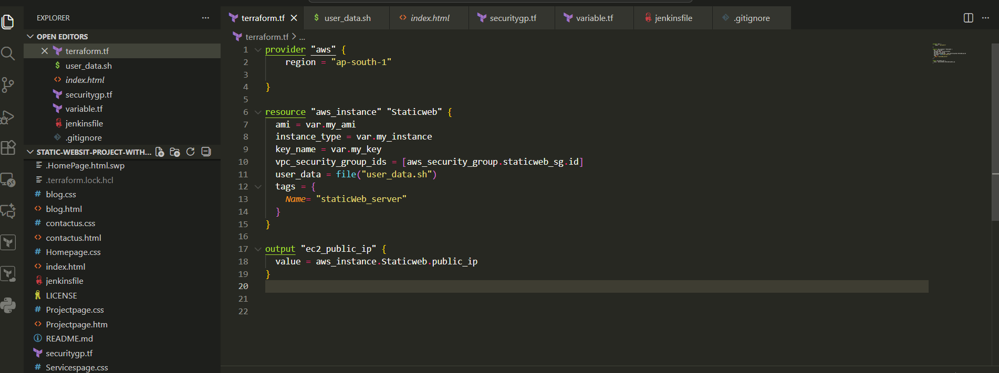

# Static-Websit-project-with-using-terraform-and-jenkins

* ## Project Overview
    This project demonstrates how to deploy a **static website** on an **AWS EC2 instance** using **Terraform** and automate updates using a **Jenkins CI/CD pipeline** with **GitHub Webhooks**.

    Whenever code is pushed to GitHub, Jenkins automatically updates the live website running on EC2.

    

* ##  Technologies Used
- AWS EC2
- Terraform
- Jenkins
- GitHub Webhooks
- Nginx Web Server
- ubuntu 

   

* ## Project Structure

   ### static-website-project/

  ├── index.html

  ├── blog.html

  ├── contactus.html

  ├── Projectpage.html

  ├── Servicespage.html

  ├── blog.css

  ├── Homepage.css

  ├── Projectpage.css

  ├── contactus.css

  ├── terraform.tf

  ├── securitygp.tf

  ├── variable.tf

  ├── user_data.sh

  ├── jenkinsfile

  ├── .gitignore

  └── README.md

  
---

* ##  Terraform Configuration

  Terraform is used to automatically create AWS infrastructure:

 * EC2 Instance  
 * Security Group  
 * Key Pair  
 * Install Nginx via User Data  
 * Clone GitHub repo to web directory  

 * ### Steps to Deploy Infrastructure

   terraform init

   terraform plan

   terraform apply

   ec2_public_ip = <0.0.0.0/0>

   http://<0.0.0.0/0>

   

   

* ## Security Group Configuration

  Allowed inbound ports:    

  Port        		   
  22	              
  80	    

  Protocol

  TCP

  TCP

  Description

  SSH Access  

  HTTP Web Access 

     

* ## User Data Automation

  * When the EC2 instance launches, the following tasks run automatically:

  * Installs Nginx

  * Starts the Nginx service

  * Clones the GitHub repository

  *  Copies website files to /usr/share/nginx/html

  *  Sets proper permissions

  

* ##  User Data Script (user_data.sh)

* This script:

 * Installs Nginx

 * Starts the web server

  * Clones the GitHub repository

  * Copies files to /usr/share/nginx/html 

  * ## Jenkins CI/CD Pipeline

    Jenkins automatically:

    Pulls latest code from GitHub

    Connects to EC2 using SSH

    Updates website files

    Restarts Nginx

* ## Jenkinsfile Pipeline

   pipeline {
    agent any

    stages {  
        stage('Clone Repository') {   
            steps {
                git 'https://github.com/<your-username>/static-website-project.git'
            }
        }

        stage('Deploy to EC2') {
            steps {
                sh '''
                ssh ec2-user@<EC2-PUBLIC-IP> << EOF
                cd /usr/share/nginx/html
                sudo git pull origin main
                sudo systemctl restart nginx
                EOF
                '''
            }
        }
    }
}

  
  

* ## GitHub Webhook Setup

*   In GitHub:

* Settings → Webhooks → Add Webhook

* Payload URL:  
http://<JENKINS_IP>:8080/github-webhook/

* ## Content type: application/json  
 * Enable Push events

* ## How the Automation Works

* Developer pushes code to GitHub

* GitHub triggers Jenkins webhook

* Jenkins pipeline runs automatically

* EC2 server gets updated content

* Website reflects latest changes instantly

* ## Live Website
 
 * http://<0.0.0.0/0>

* ## Author

* #### Name: Akash  
* ####  Role: DevOps / AWS Engineer
